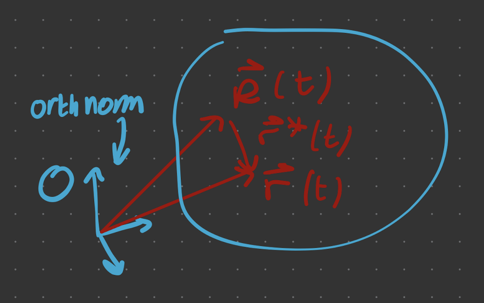

# Centre of Mass

This is all about $\vec{r}_a^*$, defined like 

> **Definition** - $\vec{r}^*$
> 
> **Define $\vec{r} ^* = \vec{R}- \vec{r}$,** where $\vec{R}$ is the CoM postion and $\vec{r}$ is a general point in a (defined) orthonormal coordinate system.
>{.is-info}

About the CoM,

$$
\sum m_a \vec{r}_{a}^*=0
$$

Prove this using the defintions of $\vec{r}^*$, $\vec{R}$ and $M$.

$$
=\underbrace{\sum m_a}_{M} \vec{R}-\underbrace{\sum m_a \vec{r}_a}_{\vec{R}}
$$

$$
=M \vec{R}(t)-M \vec{R}(t)=0
$$

Trivially, $\sum m_a \dot{\vec{r}}_a^*=0$ 

In the [[L01/continuous limit.md|continuous limit]], we get the same results, 

$$
\boxed{\int d^3 \vec{r}^* \rho(\vec{r}^*) \vec{r}^*=\int d^3 \dot{\vec{r}}^* \rho \dot{\vec{r}^*}=0}
$$

## Angular momentum relative to CoM

Take the [[L01/continuous limit.md| continuous limit]] limit of $\vec{L}$, such that 

$$
\vec{L}=\int d^3 \vec{r} ~ \rho \vec{r} \times \dot{\vec{r}}
$$

We choose the map $\vec{r}\rightarrow\vec{r}^*=\vec{r}-\vec{R}$ and $d^3 \vec{r} \rightarrow d^3 \vec{r} *$. Sub this into the definition of $L$,

$$
\vec{L}=\int d^3 \vec{r}^* \rho \left(\vec{R}+\vec{r}^*\right) \cdot\left(\vec{R}+\vec{r}^*\right) \times\left(\dot{\vec{R}}+\dot{\vec{r}}^*\right)
$$

We obtain 4 terms. 
- $\vec{R} \times \dot{\vec{R}} \rightarrow \vec{L}_{\mathrm{CoM}}$ 
- $\vec{r} \times \dot{\vec{r}}^* \rightarrow \vec{L}_{\text {about CoM}}$

There are also 2 cross terms, corresponding to $\vec{R} \times \dot{\vec{r}} ^*$ and $\vec{r} ^* \times \dot{\vec{R}}$. But these include the integrals we just showed are 0. Explicitly, they are

- $\vec{R} \times \left( \int d^3 \dot{\vec{r}}^* \rho \dot{\vec{r}}^* \right) = 0$
  
- $\left(\int d^3 \vec{r}^* \rho \vec{r}^* \right)\times \vec{R} =0$ 