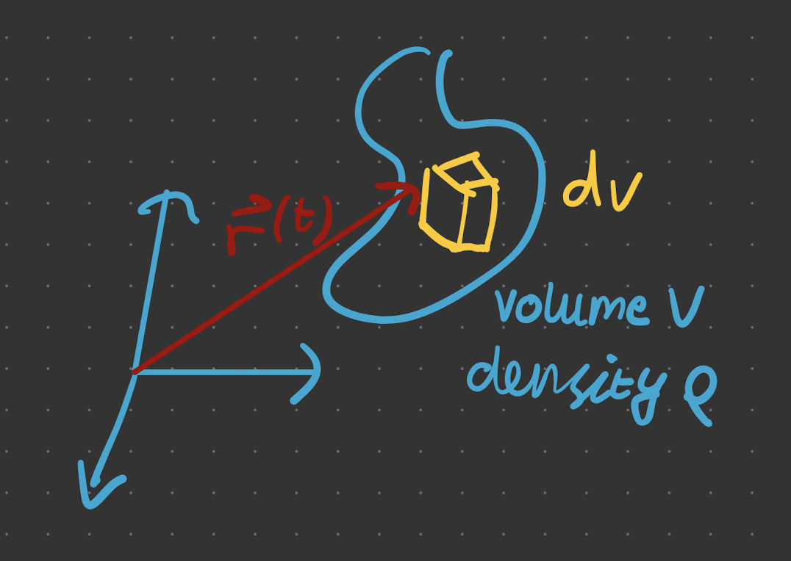

# Continuous Limit

In the continuous limit, we consider volume elements and integrate from there. For example, the CoM becomes

$$
\vec{R}=\frac{1}{M} \int d^3 \vec{r} \rho(\vec{r}) \vec{r}(t)
$$

**Angular momentum**

$$
\vec{L} = \sum_{a} m_a \vec{r}_a\times \dot{\vec{r}}_a ~\Rightarrow~\vec{L}=\int_v d^3 r \rho \vec{r} \times \dot{r}
$$