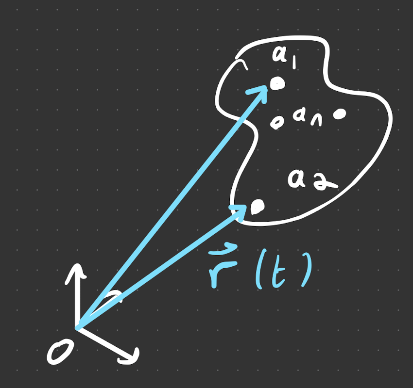

# many body systems

Consider a system of particles labelled by $a_i, ~ i = 1,...,N$. 

Define a coordinate system and origin, with the following defined quantities

## Definitions
- position vector: $\vec{r_i(t)}$ 
- momentum: $\vec{p}=m_a \dot{\vec{r}}(t)$ 
- angular momentum: $\vec{L}_a=\vec{r}_a \times \vec{p}_a$ 
- Total mass: $M=\sum_1^N m_a$.
- Centre of mass: $\vec{R}=\frac{1}{M} \sum_1^N m_a \vec{r}_a$
- Total momentum: $\vec{P} = M \dot{\vec{R}}$.
- In terms of the consituuent particles 

$$
\sum \vec{p}=\sum m_a \dot{\vec{r}}_\alpha=\frac{d}{d t}\left(\sum m_\alpha \vec{r}_\alpha\right)= M \dot{\vec{R}}
$$

We can also express the quantities in terms of the [[L01/continuous limit]].

Having defined everything, we can describe the system by:

- [[CoM.md|motion of the CoM]]
- [[CoM.md|motion relative to CoM]]

# angular momentum

