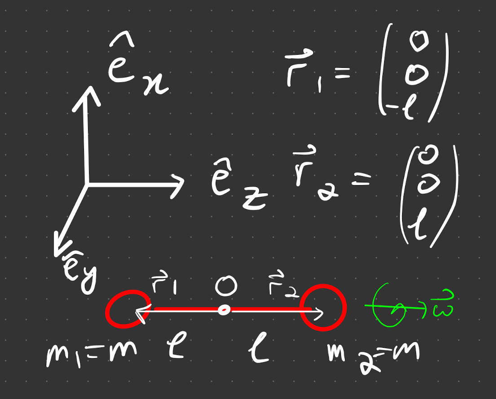
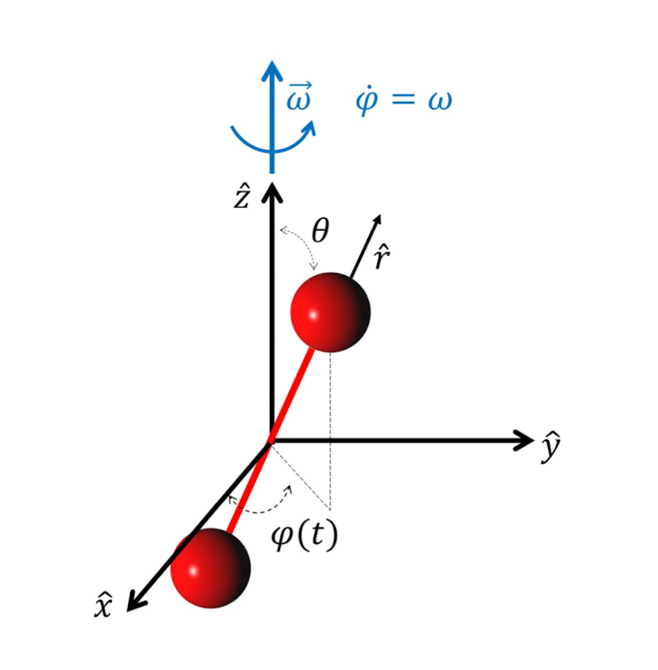

# Tensor of Inertia

Generalising the [[L02/rotframes.md|previous angular momentum result]] to a general axis of rotation. 

Consider rotations about a fixed axis, passing through the centre of mass (origin $O$ at CoM).

using this identity and plugging into our expression for [[L01/continuous limit]] continuous $\vec{L}$, we get

$$
\vec{L}=\int d^3 r \rho \vec{r} \times \dot{\vec{r}} = \int d^3 r \rho ~ \vec{r} \times \vec{\omega} \times \vec{r}
$$

Using $\vec{a} \times \vec{b} \times \vec{c}=\vec{b}(\vec{a} \cdot \vec{c})-\vec{c}(\vec{a} \cdot \vec{b})$, the integral becomes

$$
\int d^3 r \rho \left(|\vec{r}|^2 \vec{\omega}-(\vec{r} \cdot \vec{\omega}) \vec{r}\right)
$$

 explicit form

**Introduce Tensor notation**

We can factorise out the $\vec{\omega}$ $(\omega^j)$ tand show that this an equivalent expression for $\vec{L}$ as a matrix multiplication, 

$$
L=\left(\begin{array}{c}
L_1 \\
L_2 \\
L_3
\end{array}\right)=\left(\begin{array}{ccc}
I_{11} & \cdots & I_{31} \\
\vdots & \ddots & \ddots \\
I_{13} & \cdots & I_{33}
\end{array}\right)\left(\begin{array}{l}
\omega_1 \\
\omega_2 \\
\omega_3
\end{array}\right).
$$

Using this we find what the Inertia tensor is. In tensor form, the $L_i$ component is 

$$
L_i=\int d^3 r \rho\left[|\vec{r}|^2 \omega_i-r_j \omega^j r_i\right]
$$

> Because we are at the level of the individual component, the indexed terms commute.
>{.is-warning}

where we have used $\vec{r} \cdot \vec{\omega} = r_j \omega^j$. The next trick is using the $\delta_{ij}$ raising property to change $\omega_i = \delta_{ij} \omega^j$. Hence we factorise out $\omega^j$ to get

$$
\underbrace{\int_V d^3 r \rho \left[|\vec{r}|^2 \delta_{i j}-r_i r_j\right]}_{I_{ij}} \omega^j = I_{ij}\omega^j.
$$

where $I_{ij}$ is the tensor of inertia. It describes the rotating properties when there is displacement from the axis of rotation.

In the discrete case, we get 

$$
I_{ij} = \sum_a m_a\left(\left|\vec{r}_a\right|^2 \delta_{ij}-r_{a i} r_{a j}\right)
$$

> **Example** - cartesian $I_{ij}$
> when $i=j (=x)$ 
>$$
> \begin{aligned}
> I_{x x} &=\int_V d^3 r\left(x^2+y^2+z^2-x^2\right) \\
> &=\int_V d^3 r \rho \left(y^2+z^2\right)
> \end{aligned}
> $$

We now look at this in the case of a rotating dumbell

> **Example** - **dumbell**
> 
> The angular momenum $\vec{L}$ is parallel to the the axis $\vec{\omega}$. Using the ToI, discrete, we get 
> $$
> I_{i j}=\left(\begin{array}{ccc}
> 2 m \ell^2 & 0 & 0 \\
> 0 & 2 m \ell^2 & 0 \\
> 0 & 0 & 0
> \end{array}\right)
> $$
> We didn't assume anything about the components of $\vec{\omega}$, which would mean that in this coordinate system, we would get $\vec{L}\perp\vec{\omega}$ in the $\hat{e}_x ~ \hat{e}_y$ plane for any $\vec{\omega}$.
> 
>  