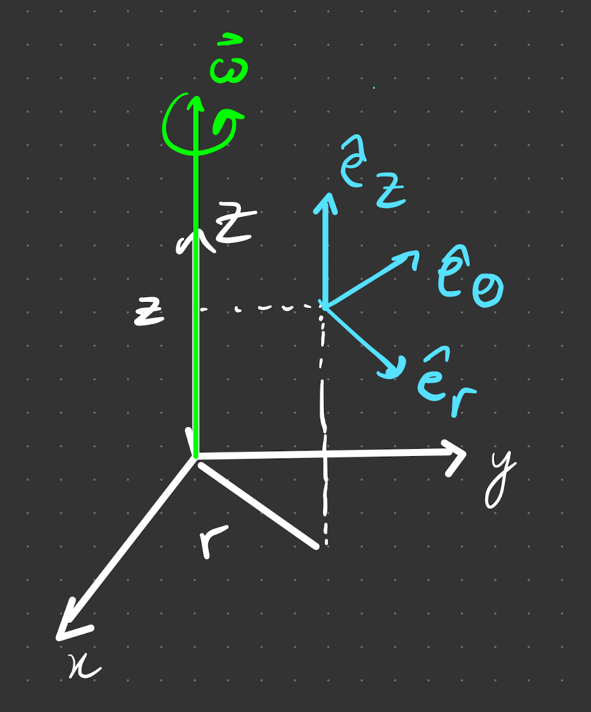

# rotation about a fixed axis

## Cylindrical coordinates

Axis of rotation is aligned with $\hat{e}_z$.

The general position vector is 

$$
\vec{r}=r \hat{e}_r+z \hat{e}_z
$$

which does not include $\theta$ coordinate. Including it would not be dimensionally consistent. It is implicit in the $\hat{e}_r$ coordinate ($\hat{e}_r (\theta) = \cos(\theta) \hat{x} + \sin(\theta) \hat{y}$).

## Time Derivatives

Using our definition $\vec{r}=r \hat{e}_r+z \hat{e}_z$, we can find $\dfrac{d \vec{r} }{ dt}$ for a rotating particle. At a fixed height $\dot{e}_z=\dot r = \dot z = 0$, we see that 

$$
\frac{d \vec{r}}{d t}=r \dot{\vec{e}}_r
$$

All the way back from first year (and in earlier parts of the course, see summer reading), for a rotating vector, 

$$
\left.\frac{d \vec{A}}{d t}\right|_I=\left.\frac{d \vec{A}}{d t}\right|_{R}+\vec{\omega} \times \vec{A}
$$

Assuming (for now) we are rotating about the $z$ axis, $\vec{\omega}= \omega \hat{e}_z$. Using orthogonality,

$$
\frac{d \hat{e}_r}{d t}=\omega \hat{e}_z \times \hat{e}_r=\omega \hat{e}_\theta ~ \Rightarrow ~ \dot{\vec{r}}=r \omega \hat{e}_\theta.
$$

(units are OK, $\omega = [\text{s}^{-1}]$)

Consider the continuous definition of angular momentum,

$$
\vec{L}=\int_v d^3 r \rho \vec{r} \times \dot{\vec{r}}
$$

Subbing in $\vec{r}=r \hat{e}_r+z \hat{e}_z$, and $\dot{\vec{r}}=r \omega \hat{e}_\theta$, we obtain 

$$
\vec{L}=\int_v d^3 r \rho r \omega\left(r \hat{e}_r+z \hat{e}_z\right) \times \hat{e}_\theta
$$

the 2 terms from $\vec{r}=r \hat{e}_r+z \hat{e}_z$ imply that we can split $\vec{L}$ into a radial and angular part, $\vec{L}=L_r \hat{e}_r+L_z \hat{e}_z$. The $L_z$ is the projection onto the $\vec{\omega}$ vector. For $r$ and $z$ we get $\omega ~ \times$ an integral. Explicitly,

$$
\begin{aligned}
&L_z=\left[\int d^3 r \rho r^2\right] \omega = I_{zz} \omega\\
&L_r=\left[\int d^3 r \rho z r\right] \omega = I_{rz} \omega
\end{aligned}
$$

which is the moment of inertia. (only for the $z$ axis!). MoI are characteristic of the body, and tell us about the behaviour of its rotations.

Typically, $\vec{L}$ is not parallel to $\vec{\omega}$. This is a consequence of the $I_{rz}$ term and the generalised result to other coordinates is the [[L02/ToI]].

Ganga wuz here