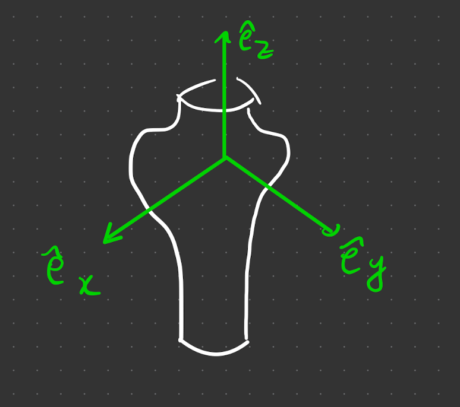

# principal axis

Consider rotations passing through the origin and CoM (so $\vec{\omega}$ points between)

the Tensor of inertia is symmetric, $I_{ij} = I_{ji}~\Rightarrow$, thus it is diagonisable and we can choose a set of real orthogonal (orthonormal) eigenvectors. Conventionally these are $\hat{e}_1, \hat{e}_2,\hat{e}_3$.

> **Definition** - **principal axes and moments of inertia**
> 
> The eigenbasis $\hat{e}_1, \hat{e}_2,\hat{e}_3$ formed from the ToI $I_{ij}$ are the principal axes of inertia.
> .
> The associated eigenvalues $I_{1,2,3}$ are the principal moments of inertia.
>{.is-info}

By definition of the basis, $I_{ij}$ must be diagonisable 

$$
I=\left(\begin{array}{lll}
I_1 & 0 & 0 \\
0 & I_2 & 0 \\
0 & 0 & I_3
\end{array}\right)
$$

Additionally we can expand $\vec{\omega}$ in this basis. This separates the rotation into the directions

$$
\vec{\omega}=\omega_1 \hat{e}_1+\omega_\alpha \vec{e}_2+\omega_3 \hat{e}_3
$$

in Einstein notation, $= \omega_i \hat{e}^i$

Therefore angular momentum becomes

$$
\vec L=\left(\begin{array}{ccc}
I_1 & 0 & 0 \\
0 & I_2 & 0 \\
0 & 0 & I_3
\end{array}\right)\left(\begin{array}{l}
\omega_1 \\
\omega_2 \\
\omega_3
\end{array}\right)
$$

## Parallel Axis

Consider now an offset in $\vec{\omega}$ from the parallel axis, in the same direction as a PA. 

$$
\vec \omega=\omega \hat{e}_1 \Rightarrow \vec{L}_1=I_1 \omega \hat{e}_1=I_1 \vec{\omega}
$$

so $\vec{L} \parallel \vec \omega$ for such parallel axis (offset) rotations.

### z axis Symmetry

Consider a plane of symmetry going through the origin. We define $\hat{e}_z = \hat z$ and 2 more orthonormal vectors $\hat{e}_y ,\hat e_z$.

With a symmetric body, contributions from opposite sides of the plane of symmetry will cancel out their contribution.

For a mass at position $(x,y,z)$, the euqal and opposite mass is at $(x,y,-z)$. This would mean the mass density $\rho(x,y,z)=\rho(x,y,-z)$. Plugging this into $I_{ij}$,

Consider splitting the volume into +ve and -ve contributions, such that

$$
=\int_{z>0} d^3 r \rho(x, y, z)(-x z) +\int_{z<0} d^3 r \rho(x, y, z)(-x z)
$$

Using the mass symmetry property, $z<0, ~ \rho(x, y, z)=\rho(x, y,-z)$. 

$$
=\int_{z>0} d^3 r \rho(x, y, z)(-x z) +\int_{z<0} d^3 r \rho(x, y, -z)(-x z)
$$

Define $z ^{\prime}= -z$, and transform the 2nd integral, 
- $z<0 \rightarrow z^\prime>0$
- $\rho(x, y, -z) \rightarrow \rho(x, y, z^\prime)$ 
- $(-x z) \rightarrow (x z ^\prime)$ 
- $d^3 r$ does not change because it's the same volume

Overall, we just pull out 1 minus sign (from $z \rightarrow z ^{\prime}$), so the integral becomes

$$
=\int_{z>0} d^3 r \rho(x, y, z)(-x z) -\int_{z ^\prime >0} d^3 r \rho(x, y, z ^\prime)(x (-z ^\prime )) = 0
$$

So we see $I_{xz} = 0 (= I_{zx})$. The proof is identical with go with $I_{yz} = I_{zy}$. ToI becomes

$$
I_{i j}=\left(\begin{array}{ccc}
I_{x x} & I_{x y} & 0 \\
I_{x y} & I_{y y} & 0 \\
0 & 0 & I_{z z}
\end{array}\right)
$$

### Rotational Symmetry

For an object which already has rotational symmetry, the matrix is diagonal if one of the (orthonormal) $\hat{e}_i$ is aligned with the symmetry axis (show this).

**proof**

if it is around the $\hat{e}_z$ direction would mean 

The plane with normal $\hat{e}_x$ is a plane of symmetry $\Rightarrow$ $I_{xy}=I_{xz}=0$.

The plane with normal $\hat{e}_y$ is also a plane of symmetry $\Rightarrow$ $I_{yx}=I_{yz}=0$.

The rotaional symmetry tells us that $I_{xx} = I_{yy}$. The variables $x$ and $y$ act the same (as a radial vector), so 

$$
\int d^3 r\left(y^2+z^2\right)=\int d^3 r\left(x^2+z^0\right)
$$

### Non-Uniqueness

We can choose any linear combination of $\hat{e}_x$ and $\hat{e}_y$. To prove this, consider the the eqn for $\vec{L}$. it becomes

$$
I\left(\alpha \hat{e}_1+\beta \hat{e}_2\right)=\left(\begin{array}{c}
I_{x x} \alpha \\
I_{y y} \beta \\
0
\end{array}\right)
$$

using $I_{xx} =I_{yy}$ 

$$
=I_{x x}\left(\begin{array}{l}
\alpha \\
\beta \\
0
\end{array}\right)=I_{x x}\left(\alpha \hat{e}_x+\beta \hat{e}_y\right)
$$

**exam technique** - *given it has a symmetry, explain why ToI has this form* - need to cancel out the masses as above 