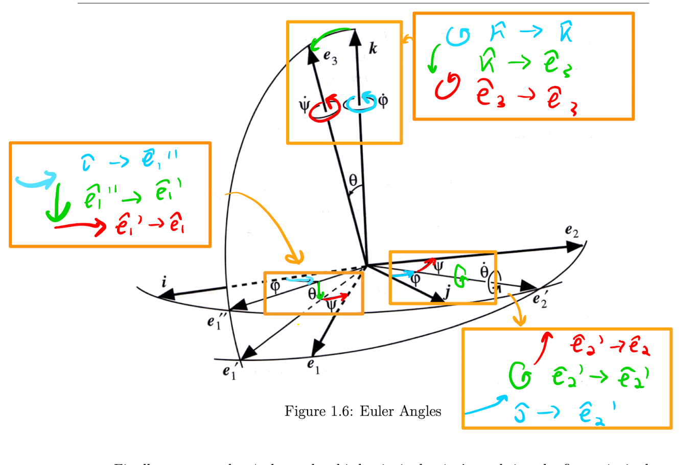

# Euler Angles

Suppose we have an (orthonormal) coordinate system $\{i,j,k\}$, which passes through the centre of mass

The coordinate system can always be rotated by 3 angles, such that our basis aligns with the [[PAOI|princial axes]].

Summerasied below 

