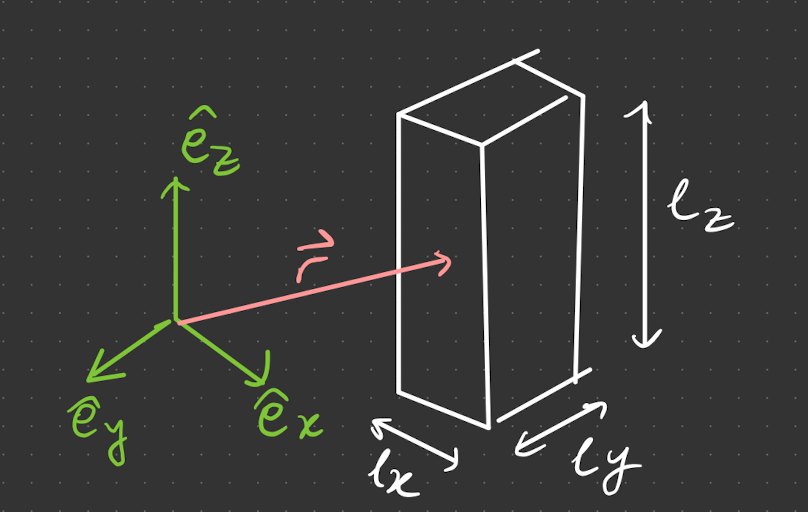

# Axes of Inertia

> **Example** - Box of uniform constant mass density $\rho$. Find the (diagonalised) tensor of inertia 
> 
> 
> Begin by defining a coordinate system parallel to axes of symmetry, $\{\hat e_x, \hat e_y, \hat e_z\}$ (not necessarily going through the centre of mass)
> 
> Computing $I_{ij}$ (see [[PLACEHOLDER]])
> $$
> I_{i j}=\int d^3 r \rho\left(|\vec{r}|^2 \delta_{i j}-r_i r_j\right)
> $$
> 
> Consider specifically $I_{xx}$ ,
> 
> $$
> I_{x x}=\int d^3 r \rho\left(y^2+z^2\right)
> $$
> 
> Splitting the integral into $dx,dy,dz$, and subbing in $\rho = \dfrac{M}{l_xl_yl_z}$,
> 
> $$
> I_{x x}=\frac{M}{l_x l_y l_z} \int_{-\frac{l_x}{2}}^{\frac{l_x}{2}} d x \int_{\frac{-l_y}{2}}^{\frac{l_y}{2}}d y \int_{-\frac{l_z}{2}}^{{\frac{l_z}{2}}} d z\left(y^2+z^2\right)
> $$
> 
> Now $\int_{-\frac{l_x}{2}}^{\frac{l_x}{2}} d x = l_x$, so the integral becomes
> 
> $$  
> \frac{M}{l_y l z}\left[\int_{-\frac{l_y}{2}}^{\frac{l_y}{2}} d y d z y^2+\int_{-\frac{l_z}{2}}^{\frac{l_z}{2}} d y d z z^2\right]
> $$
> 
> $$
> =\frac{M}{l_y}\left[\frac{1}{3} y^3\right]_{-\frac{l_y}{2}}^{\frac{l_y}{2}}+\frac{M}{l_z}\left[\frac{1}{3} z^3\right]_{-\frac{l z}{2}}^{\frac{l z}{2}}
> $$
> 
> $$
> =\frac{M}{12}\left(l_y^2+l_z^2\right)
> $$
> 
> Hence $I_{xx} = \dfrac{M}{12}(l_y^2+l_z^2)$. Since the variables are the same, we can cycle through $x,y,z$ to obtain analogous expressions for $I_{yy}$ and $I_{zz}$. We can also show $I_{yy} = I_{yz} = I_{yz}=0$ (exercise), so the total $I$ is 
> 
> $$
> I = \frac{M}{12}\left(\begin{array}{ccc}
> l_y^2+l_z^2 & 0 & 0 \\
> 0 & l_x^2+l_y^2 & 0 \\
> 0 & 0 & l_z^2+l_x^2
> \end{array}\right)
> $$ 
> 
> ## Kinetic energy
> We can also get the kinetic energy for rotations with $\vec \omega$ (along an axis going through CoM). By definition,
> 
> $$
> T=\frac{1}{2} \vec{L} \cdot \vec{\omega}=\frac{1}{2}~ \underbrace{I_{i j} \omega^j }_{=L_i}~\omega^i
> $$
> 
> In the basis of the principal axis ($e_{\text{PA}}$), $I$ is diagonalised. Decomposing $\vec \omega$ with these components, we obtain 
> 
> $$
> \vec{\omega}=\left(\omega_1, \omega_2, \omega_3\right)=\omega_i \hat{e}^i
> $$
> 
> Contracting (?) $T$ into a sum,
> 
> $$
> \begin{aligned}
> T &=\frac{1}{2} \sum_{i=1}^3 I_i \omega_i^2 \\
> &=\frac{1}{2}\left(I_1 \omega_1^2+I_2 \omega_2^2+I_3 \omega_3^2\right).
> \end{aligned}
> $$
> 
> Subbing in $I_{ij}$ components,
> $$
> =\frac{M}{24}\left(\left(l_y^2+l_z^2\right) \omega_x^2+\left(l_z^2+l_x^2\right) \omega_y^2+\left(l_x^2+l_y^2\right) \omega_z^2\right)
> $$
> .

