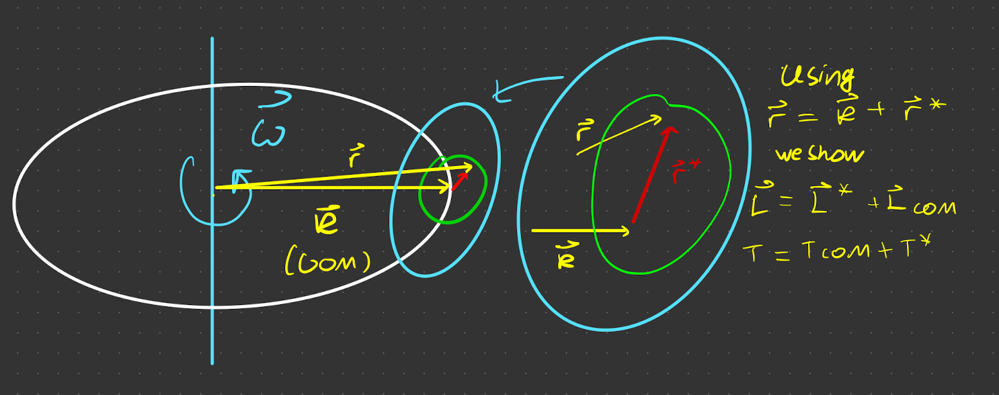
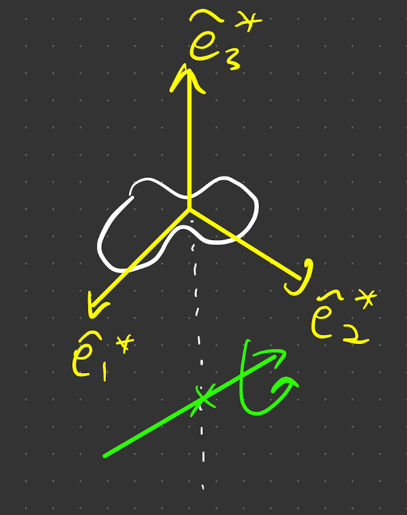

# Rotations that don't go through the centre of mass

Here we consider an object, with the rotational axis not going through the [[CoM.md|centre of mass]], as in the example (although looks like it's orbiting this is completely general, would still be the same if $\vec \omega$, went through the object)

## 'Parallel Axis Theorem'

Consider computing $I_{ij}$, with the coordiante system as in the figure, for this, we need Begin by setting the origin somewhere along the axis of rotation. Using the results for $\vec r^*$ ([[CoM.md| r star]]), we see 

$$
I_{i j}=\int_V d^3 r^*\left(|\vec{R}+\vec{r}~^*|^2 \delta_{i j}-\left(R_i+r_i^*\right)\left(R_j+r_j^*\right)\right)
$$

> Recall that with $r ^*$, the cross terms will vanish in the sum/integral! $\int d^3 r \rho r_i^*=0\left(=\int d^3 r p \dot{r}_i^*\right)$
>{.is-success}

So we get

$$
I_{i j}=\int_V d^3 r^* \rho\left(|\vec{R}|^2 \delta_{i j}-R_i R_j\right)+\int_V d^3 r^* \rho\left(\left|\vec{r}~^*\right|^2 \delta_{i j}-r_i^* r_j^*\right)
$$

$R$ is just a constant, therefore in the first integral $\int_v d^3 r^* =M$. Subbing this in,

> $$
> I = M\left(|\vec{R}|^2 \delta_{i j}-R_i R_j\right)+\int_V d^3 r^* \rho\left(\left|\vec{r}~^*\right|^2 \delta_{i j}-r_i^* r_j^*\right) \quad
> $$
> $$
> = I_{ij}^\text{COM}+I_{ij} ^*
> $$
> For an object where $\vec \omega$ **does not go through the centre of mass**
>{.is-success}

So to find the CoM

1) compute $M\left(|\vec{R}|^2 \delta_{i j}-k_i R_j\right)$ (no integration required)
2) calculate the integral $\int_V d^3 r^* \rho\left(\left|\vec{r}~^*\right|^2 \delta_{i j}-r_i^* r_j^*\right)$ 

At the front of  $I_{ij}^{COM}$, we get $\int_V d^3 r ^* \rho (...) = M(...)$ (since $\vec R $is a constant)

## $I_{ij}$ eigenvectors $\hat e^*$

Suppose we define the eigenvectors of the principal axis, $\hat e_i^*$ such that $I^* \hat e^*_i = I_i^* \hat e^*_i$, i.e. $\hat e_i^*$  is a [[PAOI.md|princial axis of inertia]]. If so, $e_i ^*$ is not necessarily a principal axis for rotations about $O$. To see this, plug this into split $I_{ij}$ to 

$$
I \hat{e}_i^*=I^{\operatorname{COM}} \hat{e}_i^* + I^* \hat{e}_i^*
$$

i.e. $\hat e_i^*$ not necessarily an eigenvector of $I_{ij}^{COM}$.