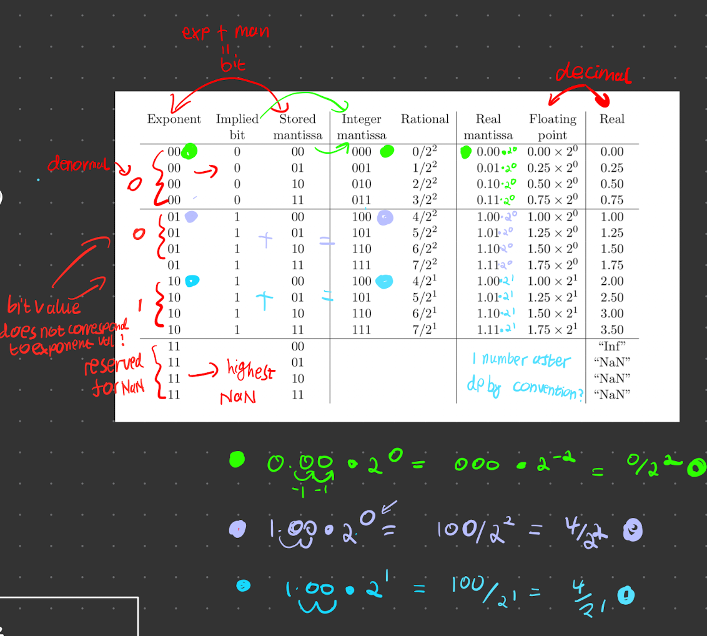

# Numbers on a Computer

Explicitly there are integers

- Integers can be signed, or unsigned (positive or negative and positive)
- Real numbers

## unsigned
Stored simply as binary. we do not have an infinite number of bits, so the finite number of bits limit the range. For $N$ bits, the range goes from $0\rightarrow2^N-1$.

If the calculation is outside of the range of the calculation, the highest bits are **discarded** (very wrong).

(NOTES ON 8x2 with table)

## signed

For integers $\geq~0$, treat it just like an unsigned. The convention of representation of negative numbers is **Two's compliment**. 

- (invert all bits of |`int`|) + 1 to go from (+ve to -ve)
- To go to negatives, -1, then (invert all bits of |`int`|)

The range is from $-2^{N-1} ~ \rightarrow ~ 2^{N-1}-1$

## Reals
Key info in the notes.

We have an infinite number of reals in a finite range. (uncountable) We thus limit the range and the values in the range. We thus represent them with rational numbers. These values are 

$$
\frac{n}{2^m}, ~ n,m ~ \in ~ `int`
$$

Any other values are rounded to the nearest representable value. This introduces a [[errors.md|rounding error]].

### **Mantissa exponent representation**

analogous to standard form, such that each number is represented as 

$$
n \cdot 2^{-m}\left\{\begin{array}{l}
n=\text{mantissa} \\
m=\text { exponent }
\end{array}\right.
$$

- For **Denomral numbers**, $n$ is between 0 and 1
- For **Normal numbers**, $n$ is between 1 and 10 (binary)
- $n$ is limited by $m$. the consequence of this is a log scale (last column in the table does not scale linearly as exponent increases). Not a huge issue with large numbers.

- $m =0$ is **denormal** - *a special case when starting at 0, it is a linear scale*
- $m =$ max is an **error condition** - NaN.

Looking at the table, We see that the *denormal (00 exponent)* increase by $0.25$, whereas with the normal numbers the difference changes based on the exponent. The steps form a log scale (prove this to yourself).
