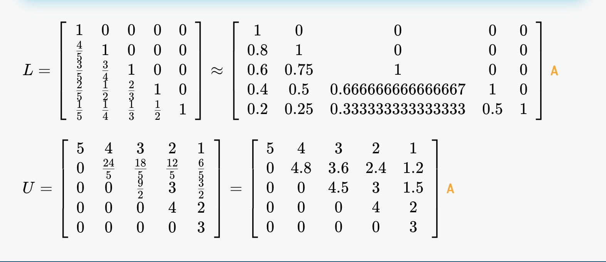

# Direct Methods

Methods which are exact in the absence of rounding (not possible on a computer).
> All these require non-zero elements
> {.is-warning}

There are 3 special cases that let us directly find the elemetns of $A$.

## Case 1 - diagonal matrix

$$
\left(\begin{array}{ccc}
D_{11} & 0 & 0 \\
0 & D_{22} & 0 \\
0 & 0 & b_{33}
\end{array}\right)\left(\begin{array}{l}
x_1 \\
x_2 \\
x_3
\end{array}\right)=\left(\begin{array}{l}
b_1 \\
b_2 \\
b_3
\end{array}\right)
$$

Assuming non-zero elements, the inverse is simply $D_{ii}^{-1} = \dfrac{1}{D_{ii}}$ ([proof here](https://proofwiki.org/wiki/Inverse_of_Diagonal_Matrix), $A^{-1}A=1$), so 

$$
\left(\begin{array}{l}
x_1 \\
x_2 \\
x_3
\end{array}\right)=\left(\begin{array}{ccc}
D_{11}^{-1} & 0 & 0 \\
0 & D_{22}^{-1} & 0 \\
0 & 0 & D_{33}^{-1}
\end{array}\right)\left(\begin{array}{l}
b_{1} \\
b_{2} \\
b_{3}
\end{array}\right)
$$

## Case 2 - Lower Diagonal Matrix, **forward substitution**

A lower diagonal matrix has everything non-zero below the elements. We label the top mid and bot row 1,2,3 respectively

$$
\left.
\begin{aligned}
&1 \\
&2 \\
&3 \\
\end{aligned}
\right|
\left(\begin{array}{ccc}
L_{00} & 0 & 0 \\
L_{10} & L_1 & 0 \\
L_{20} & L_{21} & L_{22}
\end{array}\right)\left(\begin{array}{l}
x_0 \\
x_1 \\
x_2
\end{array}\right)=\left(\begin{array}{l}
b_0 \\
b_1 \\
b_2
\end{array}\right)
$$

To find $\vec x$, we

1) start with the top row, and solve for $x_0$ (linear equation), $L_{00} x_0=b_0 \rightarrow x_0=\frac{b_0}{L_{00}}$ 
2) row 2 gives $L_{10} x_0+L_{11} x_1=b_2$. But we just found $x_0$, so we can sub that in,

$$
x_1=\frac{L_{00} b_1-L_{10}  b_0}{L_{11}L_{00}}
$$

3) the last row gives $L_{20} x_0+L_{21} x_1+L_{22} x_2=b_2$. As with the last steps, sub $x_0$ and $x_1$ to get $x_2$.

4) for higher dimensions, rince and repeat!

> This method **does not tell you what $A^{-1}$ is.**. For that, you would need [[linear AE.md|find A directly]]. It only finds $x_i$ using $L_{ij}$ 
>{.is-warning}

generally,

$$
x_0=\frac{b_0}{L_{00}} \quad \text { and } \quad x_{i>0}=\frac{b_i-\sum_{j=0}^{i-1} L_{i j} x_j}{L_{i i}}
$$

## Case 3 - upper diagonal matrix - **backward substitution**

Identical method, but we start with an upper diagonal matrix, 

$$
\left.
\begin{aligned}
&1 \\
&2 \\
&3 \\
\end{aligned}
\right|
\left(\begin{array}{ccc}
U_{00} & U_{01} & U_{02} \\
0 & U_{11} & U_{12} \\
0 & 0 & U_{22}
\end{array}\right)\left(\begin{array}{l}
x_0 \\
x_1 \\
x_2
\end{array}\right)=\left(\begin{array}{l}
b_0 \\
b_1 \\
b_2
\end{array}\right)
$$

1) Start at the bottom to find $x_2 = \dfrac{b_2}{U_{22}}$ 
2) sub $x_2$ into row 1, solve for $x_1$
3) rinse and repeat

generally

$$
x_{N-1}=\frac{b_{N-1}}{U_{N-1 N-1}} \quad \text { and } \quad x_{i<N-1}=\frac{b_i-\sum_{j=i+1}^{N-1} U_{i j} x_j}{U_{i i}}
$$

# General Cases 

## Cofactor inversion

This just means 'by hand'.

1) Find $\det A$
2) find matrix of minors $C_{ij}$.
3) Multiply $(-1)^{i+j}C_{ij}$ to form *matrix of cofactors*
4) Transpose and multiply by $\det A$ to get $A^{-1}$ 

This method has $O(N!)$ 

## Gaussian Elimination
You love to see it, adding and subtracting multiples of rows [see the wiki](https://imperialphyswiki.com/en/1st_Year/Mechanics/VectorsandMatrices/3_Linear_Equations)

explicitly, for $m$ operations, we eventually work to obtain the identity, (this is implicit in the swapping of rows)

$$
m_1m_2...m_iA  \rightarrow \mathbb{I}
$$

We also apply $m_i$ to $$ 

## LU Decomposition

For this method, assume $A$ can be written as a factor of an upper and lower diagonal matrix,

$$
A = LU ~ \Rightarrow ~ A \vec x = LU \vec x = L \vec{u} = \vec{b}
$$

where we have defined $\vec u = U \vec  x$. We see that with $L \vec{u} = \vec{b}$ we thus 

>- apply **forward** substitution to solve $L \vec{u} = \vec{b}$ to **solve for $\vec{u}$**.
>- apply *backwards* substitution to *solve for $\vec{x}$ with $U \vec  x= \vec u$* 

## Decomposing $A$

$$
\left(\begin{array}{lll}
A_{00} & A_{01} & A_1 \\
A_{10} & A_{11} & A_{12} \\
A_{20} & A_{21} & A_{12}
\end{array}\right)=\left(\begin{array}{ccc}
L_{00} & 0 & 0 \\
L_{10} & L_{11} & 0 \\
L_{20} & L_{21} & L_{22}
\end{array}\right)\left(\begin{array}{ccc}
U_{00} & U_{01} & U_{02} \\
0 & U_{11} & U_{12} \\
0 & 0 & U_{22}
\end{array}\right)
$$

There are $N^2+N$ unknowns.

### Doolittle and Crout

We can simplify the evaluation without affecting the final result by setting either $L_{ii}=1$ (Doolittle) or $U_{ii}=1$ (Clout) 

We follow similar steps to **forward substitution**.

1) the first entry gives $A_{00}=L_{00}U_{00}$. The others 

$$
L_{00} U_{01}=U_{01}=A_{01}, \quad L_{00} U_{02}=U_{02}=A_{02}
$$

2) Since $L_{00}=1$ $A_{00}=U_{00}$.

