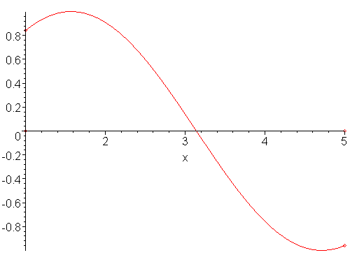

# Non-linear Equations

We are trying to solve for $f(\vec x ) = 0$.

## Bisections

Use when 2 values around the root, $x_L$ and $x_R$ with a root between them (unless there's an infinity,which tends not to be the case in physics), such that 

$$
\text{sign}(f(x_L))=-\text{sign}(f(x_R)).
$$

We zoom in on the root, by finding the midpoint such that such that $x^{(0)}= \dfrac{x_L+x_R}{2}$. The error would be $\epsilon=x_R-x_L$. Now check the sign of $f(x^(0))$ with $f(x_L)$ or $f(x_R)$. Whichever pair bracket the root, update $x_L$ or $x_R$ to $x^{(0)}$.

This makes the [[errors.md|error]] by definition $\epsilon^{(1)}=\epsilon^{(0)} / 2$

This does not generlaise easily. Difficult to find values in many dimensions that bound the root

## Newton - Raphson

Use when $x$ close to the root, such that $f(x+\Delta x)=0 \simeq f(x)+f^{\prime}(x) \Delta x$, so 

$$
\Delta x = -\frac{f(x)}{f ^\prime(x)}
$$

then we iterate to get the recursion relation $x^{i+1}=x^i-\dfrac{f\left(x^i\right)}{f^{\prime}\left(x^i\right)}$ 

> This is the best method. It easily generalises to $N$ variables,
> $$
> f_i(\vec{x}+\Delta \vec{x})=0 \simeq f_i(\vec{x})+\sum_j \frac{\partial f_i}{\partial x_j} \Delta x_i
> $$
> We effectively end up with a Jacobian 
>{.is-success}

> It can easily fail near $f ^{\prime}=0$ ! it would either diverge or not converge
>{.is-warning}

The [[errors.md|error]] on NR is 

$$
\epsilon^{(i+1)} \propto\left[\epsilon^{(i)}\right]^2
$$

(this was done in maths methods)

## Secant

Use When $f ^{\prime}(x)$ is not known. We thus need to find the derivative numerically and then plug it into Netwon-Raphson. This could be done iteratively, for example

$$
f^{\prime}\left(x^{i+1}\right) \simeq \frac{f\left(x^{i+1}\right)-f\left(x^i\right)}{x^{i+1}-x^i}
$$

(flesh this out over the weekend!!)