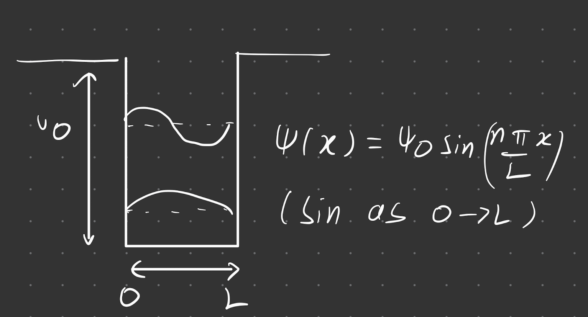
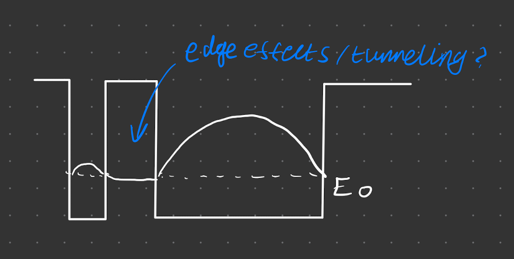
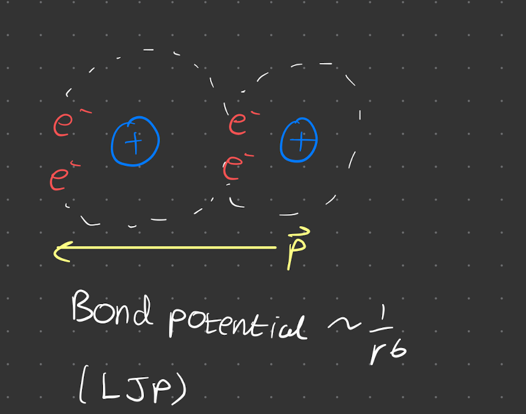

- [Quantum Basics](#quantum-basics)
  - [Well Model](#well-model)
- [Covalent Bonds](#covalent-bonds)
  - [Electron Spin](#electron-spin)
  - [PEP](#pep)
  - [Different atoms](#different-atoms)
- [Ionic Bonds](#ionic-bonds)
- [Van der Waals Bond](#van-der-waals-bond)
- [Metallic Bond](#metallic-bond)
  
# Quantum Basics

(not in the lecture notes)

## Well Model

Recap from 2nd year QM

Start with the 1D Schrodinger Equation

$$
\hat{H}=-\frac{\hbar^2}{2 m} \nabla^2+V(\mathbf{r})
$$

Solving for a well of a certain depth $V_0$, finding states $E_1$. Assyme $V_0$ large (no probablity electron exists outside of well)

$$
E_n=-\frac{\hbar^2 n^2 \pi^2}{2 m L^2}
$$

# Covalent Bonds

Model the covalent bond as 2 quantum wells close to each other.

Bringing the wells together, the energy gets lower, since $L \uparrow$

There are other effects on the energy levels 

## Electron Spin

Consider electron spin - there is still a barrier between the states. This causes 2 states to form from one $\Delta E$ due to electron splitting. Net effect is the formation of bond potential 

## PEP

missed this bit

## Different atoms

Wells are now different size. Electron minimises energy, and most probability in the larger well (energy $\propto \frac{1}{L^2}$)

# Ionic Bonds

Energetically favourable to transfer an electron e.g. forming NaCl

There is a coulomb interaction forming the bond (wholly positive attracts wholly negative)

# Van der Waals Bond

2 overall neutral atoms self polarise - directional charge

# Metallic Bond

We have $N$ electrons. The states are really close together 

$$
E_n < -\frac{\hbar^2n^2  \pi^2}{2 m N^2 L^2}
$$

(inequality due to finite spacing between)

Each quantum well provides $1$ electron, and each of the little energy levels can hold $2$ electrons. That means we have $n = \frac{N}{2}$ energy levels. That means the maximum energy is bounded, such that 

$$
E_n < -\frac{\hbar^2 (\frac{N}{2})^2  \pi^2}{2 m N^2 L^2} = -\frac{\hbar^2 \pi^2}{8 m L^2}
$$

as in the $2$ electron case!