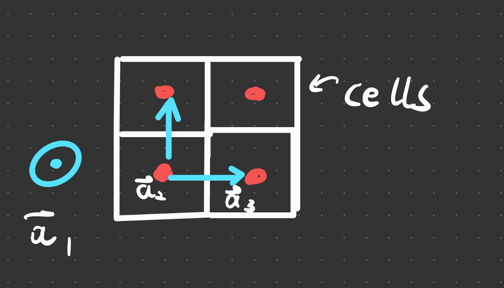

We navigate the crystal by defining vectors that fill the lattice space, the shortest possible ones are the primitive lattice vectors

> **Definition** - Primitive lattice vectors.
> 
> The shortest possible ones are the primitive lattice vectors. They can be in $n$ dimensions.
> 
> (**Not necessarily unit vectors! (duh)**)
>{.is-info}

> **Definition** - Lattice points/sites.
> 
> Positions in the crystal. Their position is denoted by $\vec{R}$ , such that  
> $$
> \vec{R}=n_1 \vec{a}_1+n_2 \vec{a}_a+n_3 \vec{a}_3
> $$
> where $\vec{a}_i$ are the lattice vectors.
>{.is-info}

> **Definition** - Basis/motif.
> The thing that repeats inside of the [[unit cell]]. 
>{.is-info}