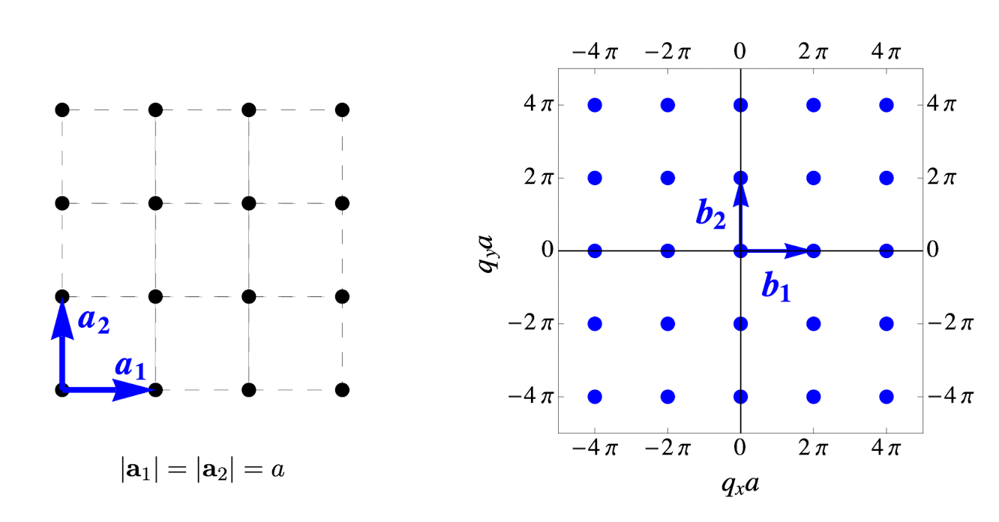
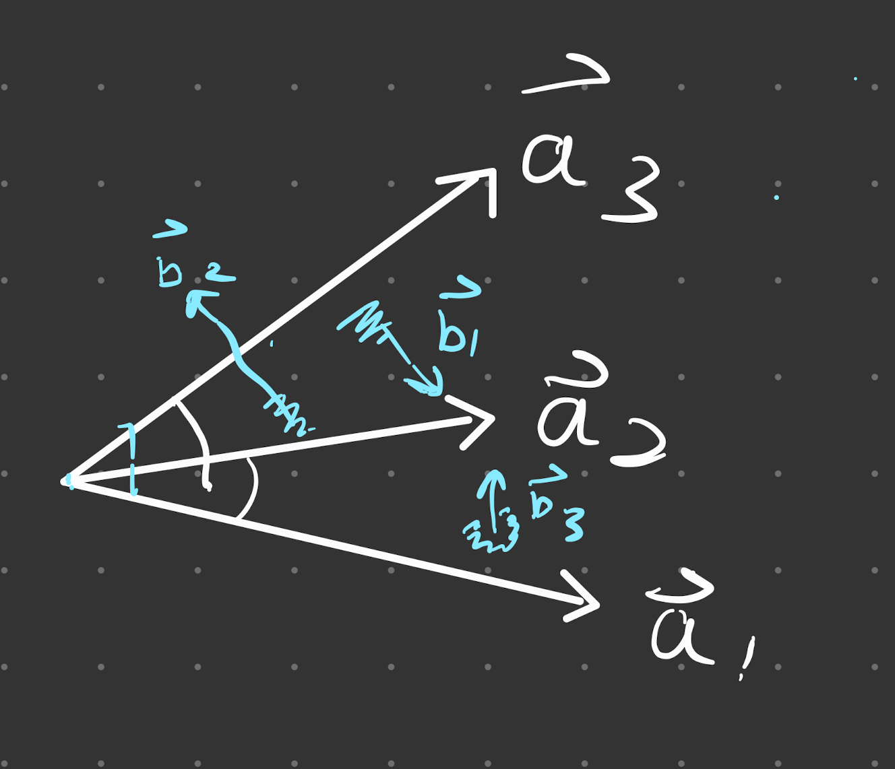
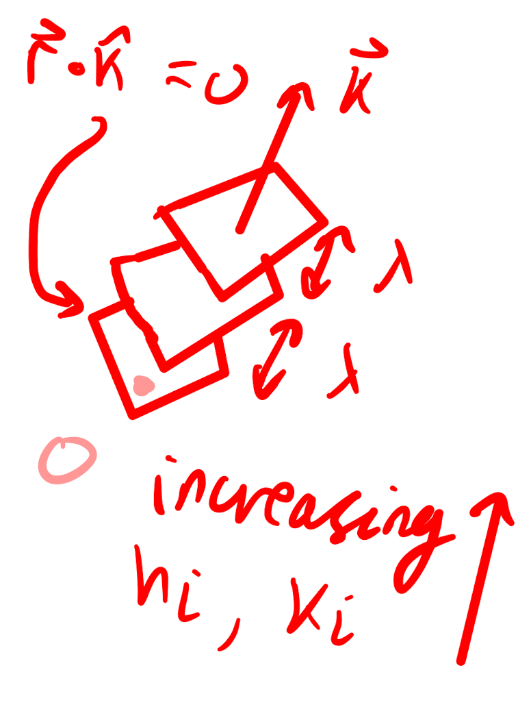
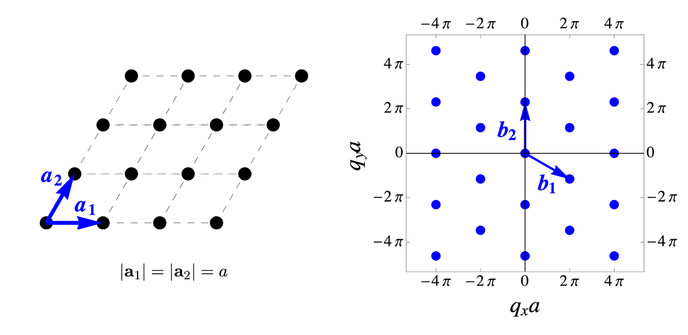

- [Reciprocal space](#reciprocal-space)
  - [Plane Waves](#plane-waves)
  - [Reciprocal lattice vectors](#reciprocal-lattice-vectors)

# Reciprocal space

The crystal is governed by discrete points i.e. a real space discrete symmetry, and waves interact with lattice points. Since plane waves ($e^{i \vec{k} \cdot \vec{r}-\omega t}$) are governed by $\vec{k}$ and $\omega$, we work in $\vec{k}$ space (reciprocal space). The $\vec{k}$ space for a square lattice is shown below (also square)

## Plane Waves

Consider splitting $\vec{k}$ into 3 components,

$$
\vec{k}=k_1 \vec{b}_1+k_2 \vec{b}_2+k_3 \vec{b}_3.
$$

At the moment $k_i$ are arbitrary. If we choose them to be integers s.t. $k_i = h_i$, and sub this into $e^{i \vec{k} \cdot \vec{r}}$, then in the exponent we obtain (for the spatial part)

$$
e^{i \vec{k} \cdot \vec{r}}=e^i\left(\sum_i k_i \overrightarrow{b_i}\right) \cdot\left(\sum_j n_j \vec{a}_j\right).
$$

Consider choosing orthogonal $a_i$ and $b_j$, such that $a_i \cdot b_j = 2\pi \delta_{ij}$ (this just means a wave travelling in a particular direction). In words, the wave vector component $\vec{b}_i \perp \vec{a}_{j,k}$. (Remember, $\vec{a}_i$ need not be orthogonal, see [[Nomenclature]]). For example:

where each of the $\vec{b}_i$ have been drawn to be in the plane defined by $\vec{a}_{j,k}$ (i guess as a basis they should go from the same point, but drawn like this for clarity).

Taking this definition, and expanding out the sum (in 3D),

$$
e^{i \vec{k} \cdot \vec{r}} = e^{i 2\pi (n_1h_1 + n_2h_2+n_3h_3)} = 1 ~ \forall ~ n_i, h_j.
$$

${\vec{k} \cdot \vec{r}} = 2\pi (n_1h_1 + n_2h_2+n_3h_3)$ can be interpreted as geometric planes ($\vec{r} \cdot\hat{n} = k$), which are stacked on top of each other. The factor of $2\pi$ ensures they are each 1 $\lambda$ apart. In this plane, we are interested in $\vec{r} = \vec{R}$.

Given the definition of $\vec{a}_i$, we can find the direction of $\vec{b}_j$, such that 

$$
\vec{b}_i=2 \pi \frac{\vec{a}_j \times \vec{a}_k}{\vec{a}_i \cdot\left(\vec{a}_j \times \vec{a}_k\right)}
$$

- the cross product $\vec{a}_j \times \vec{a}_k$ ensures it is perpendicular (by defn)
- the $2\pi$ and denominator are a scale factor that ensure we get $2\pi \delta_{ij}$.

## Reciprocal lattice vectors

Using a lattice site $\vec{R}=n_1 \vec{a}_1+n_2 \vec{a}_a+n_3 \vec{a}_3$ and the above, 

We use *Miller indeces* to define the points in reciprocal space. This is a coordinate $(h_1,h_2,h_3)$ that corresponds to the reciprocal vector of a particular lattice point, 

$$
\vec{G}= h_1 \vec{b}_1+ h_2 \vec{b}_2+ h_3 \vec{b}_3.
$$

We calculate 

> **Example** - Calculating the reciprocal lattice vectors for the triangular lattice for the lattice in the image
> 
> where $\vec{a}_1=(a, 0) \text { and } \vec{a}_2=(1 / 2, \sqrt{3} / 2) a$
> 
> **Method 1** - matrices and $a_ib_j = 2\pi \delta_{ij}$ 
> Construct matrices of the lattice vectors such that 
> $$
> \left(\begin{array}{cc}
> 1 & 0 \\
> \frac{1}{2} & \frac{\sqrt{3}}{2}
> \end{array}\right)\left(\begin{array}{ll}
> b_{1 x} & b_{2 x} \\
> b_{1 y} & b_{2 y}
> \end{array}\right)=2 \pi \delta_{i j}.
> $$
>  
> Recall that $\delta_{ij} = \mathbb{I}$, we simply invert the matrix to obtain $b_{ij}$
> 
> $$
> \left(\begin{array}{ll}
> b_{1 x} & b_{2 x} \\
> b_{1 y} & b_{2 y}
> \end{array}\right)=\sqrt{3} \pi\left(\begin{array}{cc}
> \frac{\sqrt{3}}{2} & 0 \\
> -\frac{1}{2} & 1
> \end{array}\right)
> $$
> 
> (factor of $\sqrt3\pi$ comes from calculating the determinant)
> 
> **Method 2** - using the formula $\vec{b}_i=2 \pi \dfrac{\vec{a}_j \times \vec{a}_k}{\vec{a}_i \cdot\left(\vec{a}_j \times \vec{a}_k\right)}$. 
> 
> Although we are in 2D, simply define the 3D vector $\vec{a}_k=\hat{z} = (0,0,1)$, then compute (exercise for revision).

> The defining property of scattering reciprocal lattice vectors $\vec{G}$ is that for lattice sites $\vec{R}$,
> $$
> e^{i \mathbf{G} \cdot \mathbf{R}}=1 \quad \text { for all lattice points } \mathbf{R} \text {in the real-space lattice.}
> $$
> See [[allowed scattering lattice vectors]] for a proof
>{.is-warning}

Generally, for a lattice width $a$, the lattice vector $k$ will be $$ 

