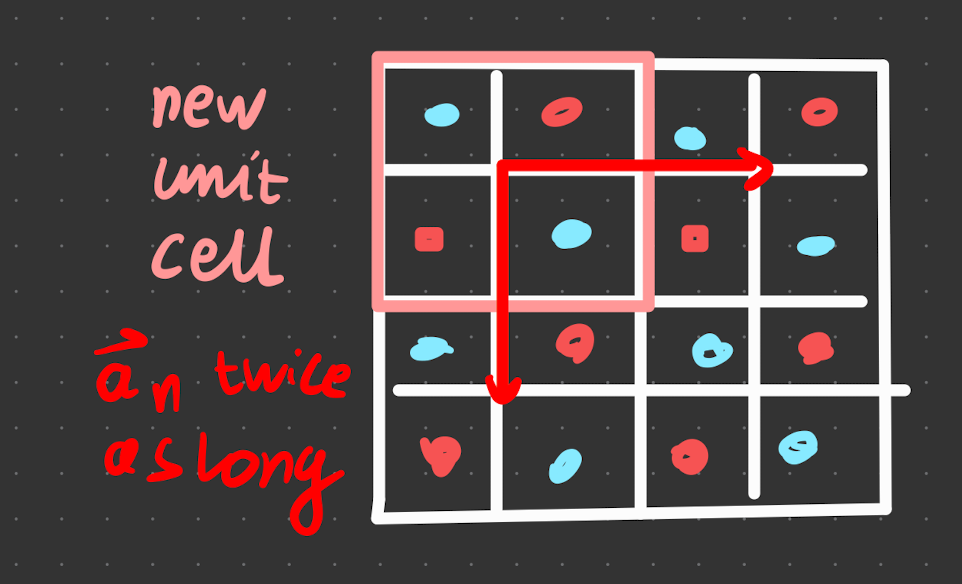
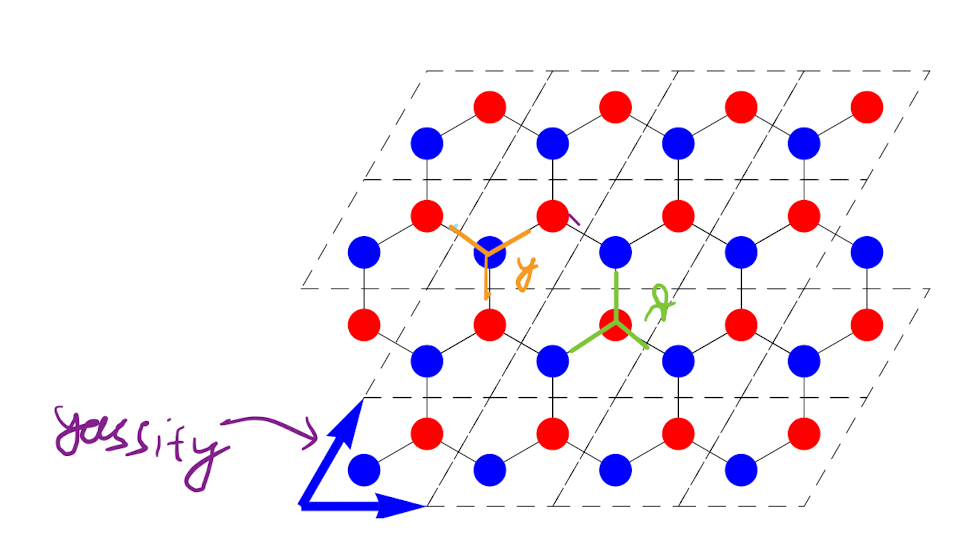
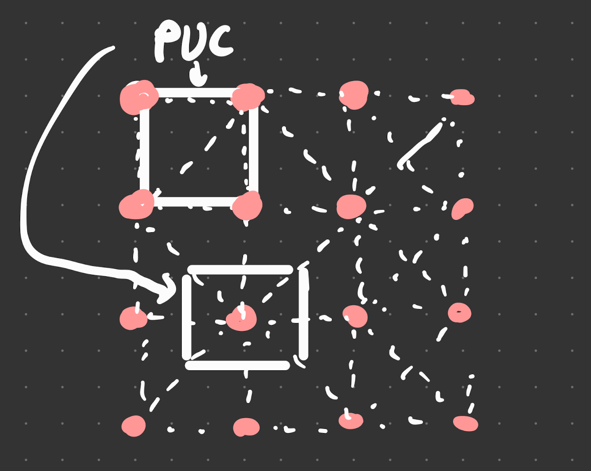

- [Unit Cell](#unit-cell)
  - [Primitive unit cell](#primitive-unit-cell)

# Unit Cell

> **Definition** - Unit Cell
> This is the basic building block of the lattice. Best to think of them containing a point in space where we can put atoms and molecules.
> Unit cells fill the entire space of the crystal.
>{.is-info}

Unit cells need not contain 1 atom. They just won't be Bravais Lattices (see below), for example below

In the diagram, there is alternating red and blue atoms. That means one unit cell can contain all 4. 

Some key points:
- the vectors (see [[Nomenclature]]) need not be orthogonal, neither the same length. It depends on size of unit cell
- unit cells are not unique, in the example above, it could be 1x2 or 2x1.
- The basis can significantly change the properties of the system

> **Definition** - Bravais Lattice.
> unit cell that contains 1 atom
>{.is-info}

Combining the Bravais lattice + Basis (see[Nomenclature]]), we obtain the crystal structure.

> **Example** - Below is a diagram of the graphene lattice. (yassify because notes says decorating)
> 
> 
> 
> Since the red and blue atoms are distinct, there is not 1 atom in the unit cell, therefore it is not a Bravais lattice.

The **Weigner-Seitz Cell** has only 1 atom inside it, as opposed to pieces of others.

## Primitive unit cell

The **primitive unit cell** has a single lattice point in it. It is constructed using the primitive lattice vectors.

1 way to construct is to draw all the perpendicular bisectors, and construct from it. As long as it has *1 lattice point*. It doesn't matter how to construct them, as long as they tessellate and have the same volume. 

To show this, suppose the PUC has a volume $V_\text{PUC}$, there have $N$ cells, and the number density is $n_\text{at}$. The total number density $n = \dfrac{N}{V_t} = \dfrac{N \cdot n_\text{at}}{ N \cdot V_\text{PUC} \cdot } = \dfrac{n_\text{at}}{V_\text{PUC}}$. So by definition of the PUC, they most all contain the same number of atoms (this is so weird why did he include this)

