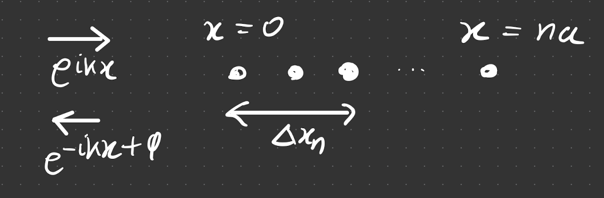
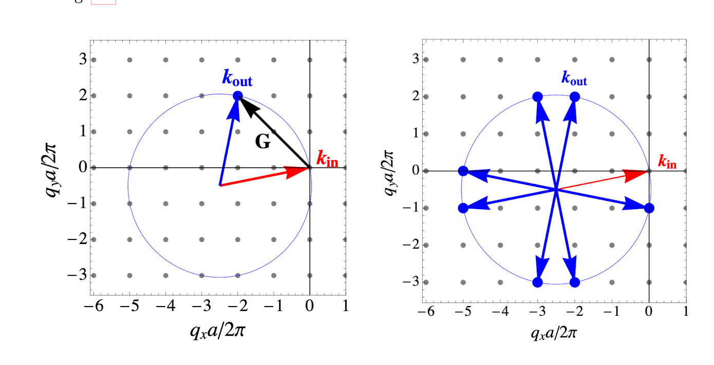

# 1D Scattering

Consider a plane wave approaching a 1D crystal. Each of the lattice points is a distance $a$ apart. The waves approaching it can be incoming our outgoing. The incoming wave travels a distance $\Delta x_n$, interacts with a particle and is reflected. Hence, it will change its direction and incur a phase change.

- The length $\Delta x_n = 2na$
- The phase change is $\Delta \phi = k \Delta x_n = 2kna$. The backscattered phase change will be some multiple of $2\pi$, which means for them to even reach the end (and not be gone due to destructive interference), we need *all* the backscattered waves to constructively interfere. 

$$
2kna = h\left( 2\pi \right)
$$

The lattice points oscillate when the light reaches them and form their own wave (equivalent of spherical in 3D). For these to be in phase, each oscillation must be $2\pi h$ out of phase from its nearest neighbour, causing a cascade. With $n$ lattice points, $h = m\times n$ (this guarantees *all* are in phase) therefore we impose the scattering condition on $k$,

$$
k = m\frac{\pi}{a}.
$$

The change in momentum (in natural units, $\hbar =1$ s.t. $p = \hbar k$ ) is 

$$
q = k_\text{out} - k_\text{in} = -2k,
$$

where the $-2k$ comes from the elasticity condition. This is the *Laue condition*.

# Elastic scattering in 3D

### Assumptions
1) Elastic collision: $\left|\vec{k}_{\text {in }}\right|=\left|\vec{k}_{\text {out }}\right|$
2) Laue condition - generalise this to 3D, so $\vec{q}=\vec{k}_{\text {out }}-\vec{k}_{i n}$.
3) For scattering, recall [[Reciprocal Space| the discrete lattice point condition]], $\vec{k}=h_1 \vec{b}_1+h_2 \vec{b}_2+h_3 \vec{b}_3$, which means (for the difference) we define $\vec{G}= \vec{q} = h_1 \vec{b}_1+h_2 \vec{b}_2+h_3 \vec{b}_3$. 

> $\vec{G}$ takes discrete values (due to $h_i$), which are mapped as points on the **Ewald sphere**
> 
> Here we are in reciprocal lattice space, and for a particular $\vec{k}_\text{in}$, we see there are (in this case, in 2D) 7 possibilities for $\vec{k}_\text{out}$ (since $\vec{k}$ is discrete and we are in reciprocal space). Recall it needs to be discrete to constructively interfere.
> This means $\left|\vec{G}\right| = m\dfrac{2\pi}{a}$, as in the 1D case.
>{.is-warning}

Combining the assumptions, consider, $\left|\vec{k}_{\text {out }}\right|^2$,

$$
\left|\vec{k}_{\text {out }}\right|^2=\left(\vec{k}_{\text {out }}\right) \cdot\left(\vec{k}_{\text {out }}\right) =\left(\vec{k}_{\text {in }}+\vec{G}\right) \cdot\left(\vec{k}_{\text {in}}+\vec{G}\right)
$$

$$
= \left| \vec{k}_{\text {in }}\right|^2+2 \vec{k}_{\text {in }} \cdot \vec{G}+\vec{G} \cdot \vec{G}
$$

Using $\left|\vec{k}_{\text {in }}\right|^2=\left|\vec{k}_{\text {out }}\right|^2$, we get

$$
\boxed{2 \vec{k}_{\text {in }} \cdot \vec{G}+\vec{G}^2 = 0}
$$

This is the **Laue Condition** for scattering. 

