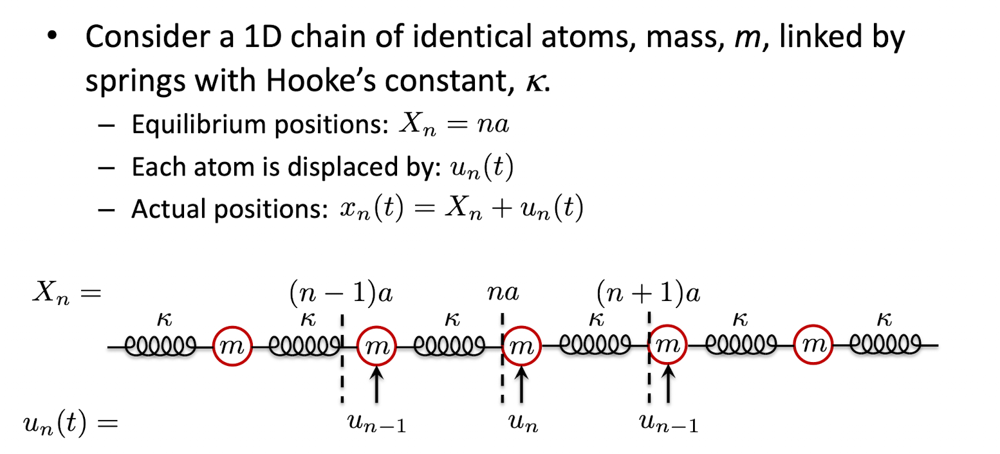
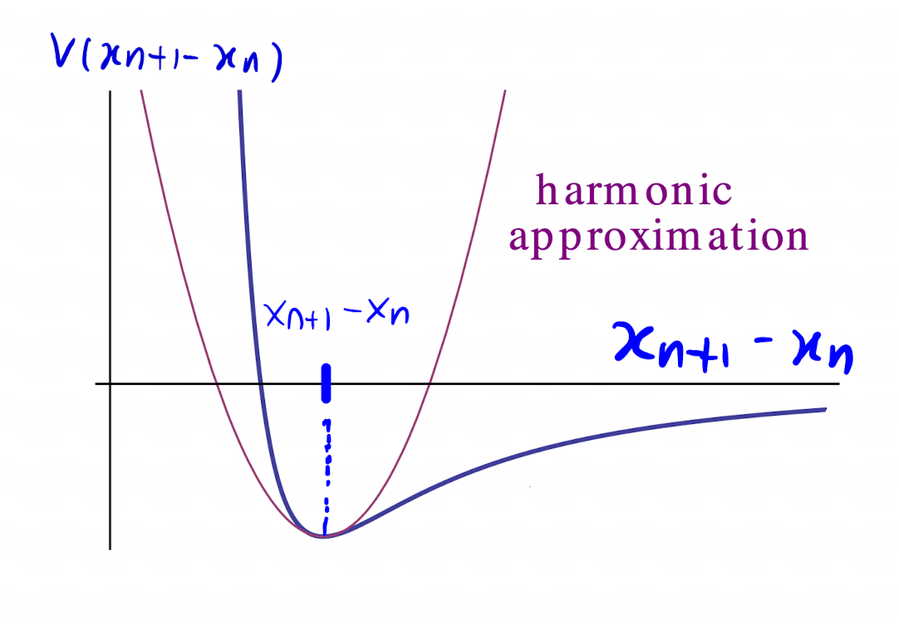

# 1D monoatomic chain

just read the notes...
(electrical waves!!)

## system 

> There are 2 different k's in this derivation!
> - $\kappa$ (kappa) - spring (force) constant
> - $k$ (kay) - wavevector magnitude
>{.is-warning}

Define the system as in the slide 

## Potential

The potential between adjacent atoms can be characterised by argument. Effectively, there is an LJP between them, which motivates us to change to the coordinate system of the relative distance between them, given by $x_{n+1}-x_{n}$.

$V$ depends on the type of bonds. The functional form is not too important (in this case roughly an LJP). We are interested in the behaviour at the minimum, $X_{n+1}-X_{n}$.

Consider expanding around the eqbm point with *2 variables*. $x_{n+1}$ and $x_{n}$. At this point $\dfrac{\partial{V}}{\partial {x_n}} = \dfrac{\partial{V}}{\partial {x_{n+1}}}=0$, hence no 1st order term. up to second order,

$$
V\left(x_{n+1}-x_n\right)=V\left(X_{n+1}-X_n\right) + \frac{1}{2} \frac{\partial^2 V}{\partial x_{n+1}{}^2}\left(x_{n+1}-X_{n+1}\right)^2 
$$

$$
-\frac{\partial^2 V}{\partial x_n \partial x_{n+1}}\left(x_{n+1}-X_{n+1}\right)\left(x_n-X_n\right) + \frac{1}{2} \frac{\partial^2 V}{\partial x_n{ }^2}\left(x_n-X_n\right)^2
$$

(why does the cross term have a -ve sign?)

If we define $\left.\dfrac{\partial^2 V}{\partial x_i \partial x_j}\right|_\text{ebm}=\kappa_{ij} = \kappa$ (the same force constant between all atoms), we can generalise our potential

$$
\boxed{V_\text{tot}=V_0+\frac{\kappa}{2} \sum_{n = -\infty}^\infty\left(u_{n+1}-u_n\right)^2}
$$

## Equation of motion

For the $n$th atom, the equation of motion is $F_n=-\dfrac{\partial V_{\mathrm{tot}}}{\partial x_n}$

Since $u_n =x_n + X_n,~~ \dfrac{\partial}{\partial x_n}=\dfrac{\partial}{\partial u_n}\left(\dfrac{\partial u_n}{\partial x_n}\right)=\dfrac{\partial}{\partial u_n}$. Likewise $\ddot{u}_n = \ddot{x}_n$.

The force on the $n$th atom only depends on its coupling to its nearest neighbours, so 

$$
F_n = m\ddot{u}_n = -\dfrac{\partial V_{\mathrm{tot}}}{\partial u_n} = -\frac{\kappa}{2} \frac{\partial}{\partial u_n}\left(\left(u_{n+1}-u_n\right)^2+\left(u_n-u_{n-1}\right)^2\right)
$$

taking the derivative, then cancelling terms,

$$
\begin{aligned}
&=-\frac{\kappa}{2}\left(-2\left(u_{n+1}-u_n\right)+2\left(u_n-u_{n-1}\right)\right) \\
&\boxed{\ddot{u}_n=\frac{\kappa}{m}\left(u_{n+1}+u_{n-1}-2u_n\right)}
\end{aligned}
$$

## Solve with ansatz

Assume an ansatz: $u_n=\operatorname{Re}\left\{\tilde{u} e^{i k X_n-i \omega t}\right\}$ 

> Specifically $k$ (kay) and specifically discrete $X_n$ values! (so $X_{n+1}=(n+1)a$ and $X_{n-1}=(n-1)a$)
>{.is-warning}

Plugging this ansatz into the DE,

$$
-\omega^2 u_n=\frac{k}{m}\left\{e^{i k a}+e^{-i k a}-2\right\} u_n.
$$

So we get an explicit form for $\omega(k)$, i.e. a *dispersion relation*

$$
\omega^2=\frac{\kappa}{m}(2 \cos k a-2)=\frac{2 \kappa}{m}(\cos k a-1) = 4\omega_D{}^2\sin^2\left(\dfrac{ka}{2}\right),
$$

where we have defined the **Debye Frequency** as $\boxed {\omega_D = \sqrt{\dfrac{\kappa}{m}}}$.

We thus obtain a disperison relation,

$$
\omega(k)=2 \omega_D \left|\sin \left(\frac{k a}{2}\right)\right|
$$

We take the absolute value of sin as $\omega$ cannot be negative (?). We discuss its properties in [[solution redundancy]]

The general solution would be a sum over different values of $k$ (not necessary discrete?), 

$$
u_n(t)=\operatorname{Re} \sum \tilde{u}_k \exp \left[i\left(n k a-\omega_k t\right)\right]
$$

> We have made the assumption tat  only take *discrete* values of $X_n=na$, so it is only valid at those points
>{.is-warning}

