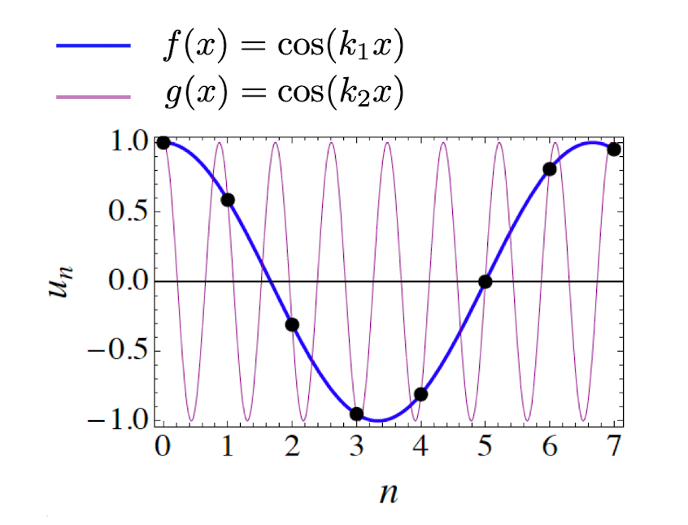
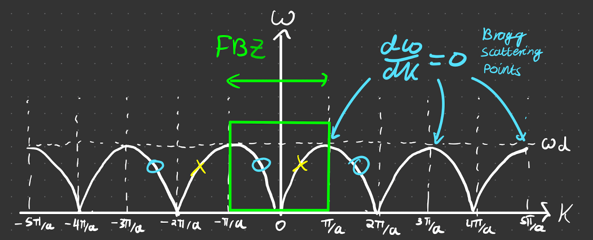
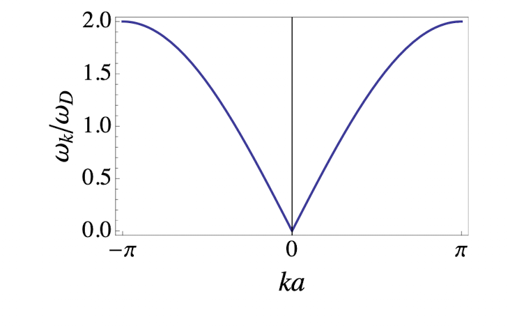
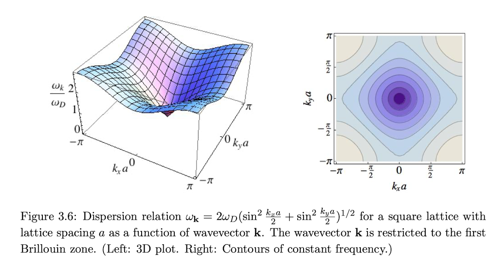
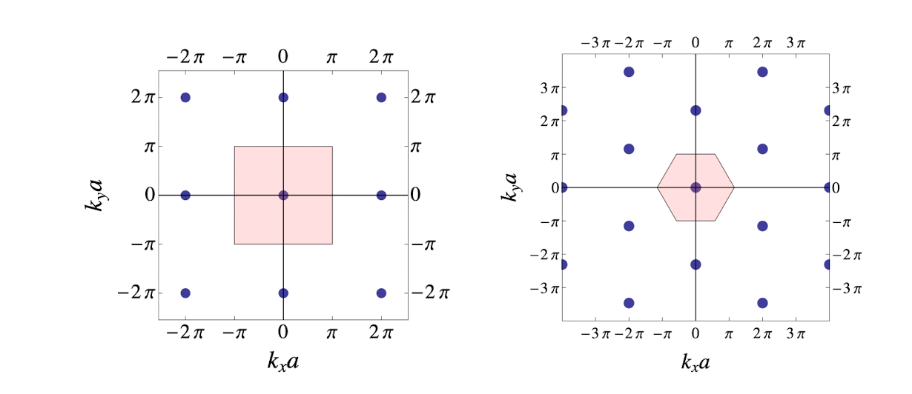

# solution redundancy

## Consequences of $X_n = na$ 

Conside the general solution to the [[1D monoatomic chain]]. We were able to derive $\omega(k)=2 \omega_D \left|\sin \left(\frac{k a}{2}\right)\right|$ on the assumption that $X_n = na$ *specifically*.

NOW Consider two general cosine functions (completeley arbitrary, not the ones as in the dispersion relation), such that $f(x)=\cos \left(k_1 x\right)$ and $g(x)=\cos \left(k_2 x\right)$. In the particular example that $k_1=0.3 \frac{\pi}{a}, \text{and} ~ k_2=2.3 \frac{\pi}{a} = 0.3 + \frac{2\pi}{a}$, we get the functions as in the figure below

The black points are when $X = na$. Explicitly, we see that adding $\frac{2\pi}{a}$ to the wave vector does not change the value of the function. 

More generally, when $k_2=k_1 + h \dfrac{2 \pi}{a}$, at the specific points $X_n = na$,

$$
\cos(k_2 na )= \cos((k_1 + h \dfrac{2 \pi}{a})na) = \cos(k_1 na) ~ (\text{black points})
$$

## First Brillouin Zone (FBZ)

Consider a sketch of $\omega(k)= 2\omega_D \left|\sin \left(\frac{k a}{2}\right)\right|$,

We see that there are multiple values of $k$ for the same $\omega$. For a particular $\omega$, these arise at intervals of $k = 2n\pi/a$. However, if we plug them into our solution for $u_n$, in the same light as we have just seen

$$
u_n(t)=\operatorname{Re} \sum \tilde{u}_k \exp \left[i\left(\left(k+\frac{2\pi}{a}h\right)na-\omega_k t\right)\right]
$$

$$
=\overbrace{\exp\left[2\pi ihn \right]}^{=1}\operatorname{Re} \sum \tilde{u}_k \exp \left[i\left(n k a-\omega_k t\right)\right] = u_n(t)
$$

In other words, the larger values of $k$ seperated by $2\pi/a$ from the value within the **First Brillouin Zone** (FBZ) have an *identical* effect on the dynamics of the lattice (this is case in 1D). 

> **Definition** - **First Brillouin Zone (FBZ)**
> The function $\omega(k)$ within the range $-\dfrac{\pi}{a}<k \leq \dfrac{\pi}{a}$ (one $\leq$ so as for it to be $2\pi/a$ and no repeated solution for $u$ )
>{.is-info}

The width of the FBZ is the same as the[[allowed scattering lattice vectors.md|reciprocal unit cell length]]) ($\frac{2\pi}{a}$), which makes it a [[Unit Cell.md| Wigner-Setiz unit cell in k space]]. 

We only need only the reciprocal unit cell in $k$ space to specify **all** states, because of the above redundancy. 

This means all the information of the lattice vibrations, for any $k$, is encapsulated in the FBZ (to get to higher $k$, just add $h \dfrac{2\pi}{a}$ and you will have the same lattice behaviour). 

## wave velocity

### long $\lambda$ (small $k$)

  at $k \ll 1$, (small angle approx) $\omega \approx \omega_D ka$, so $c = \omega_D a$, so a constant velocity dependent on the properties of the material, i.e. a sound wave

### group velocity

Consider the group velocity $v_g = \dfrac{d \omega }{d k}$, i.e. the gradient of the function.

When $v_g = 0$, $k = (2\pi h + \pi)/a$. Physically the [envelope is not moving](https://en.wikipedia.org/wiki/Group_velocity#:~:text=The%20group%20velocity%20of%20a,the%20wave%E2%80%94propagates%20through%20space.), in other words standing waves are formed at the lattice points! ($X = na$ only). This is also the condition [[allowed scattering lattice vectors.md| the condition for bragg scattering]].

## 3 Dimensions 

The [[1D monoatomic chain]] generalises to 3D in the following way,

$$
\omega_{\mathbf{k}}^2=4 \omega_D^2\left(\sin ^2 \frac{k_x a}{2}+\sin ^2 \frac{k_y a}{2}+\sin ^2 \frac{k_z a}{2}\right)
$$

Again all the information is confined to the 3D WS FBZ.

**Definition** - **N Dimensional FBZ**
> the FBZ is defined as the WZ (RLP at centre) unit cell centred at $\vec{k}=0$.
> This means the components of $\vec{k}$ must satisfy
> $$
> -\frac{\pi}{a}<k_{x, y, z} \leq \frac{\pi}{a}
> $$
>{.is-info}

 **The WS cell can be any shape**

