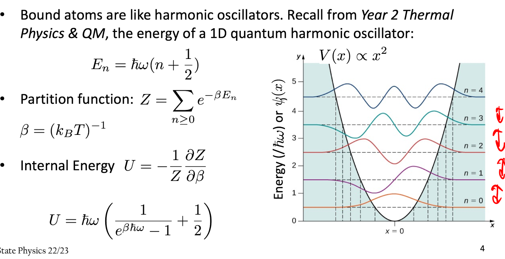
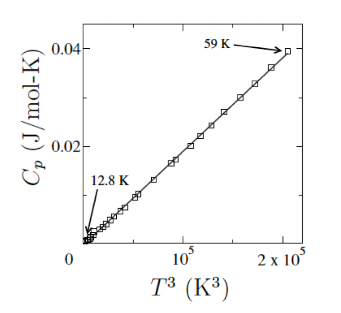
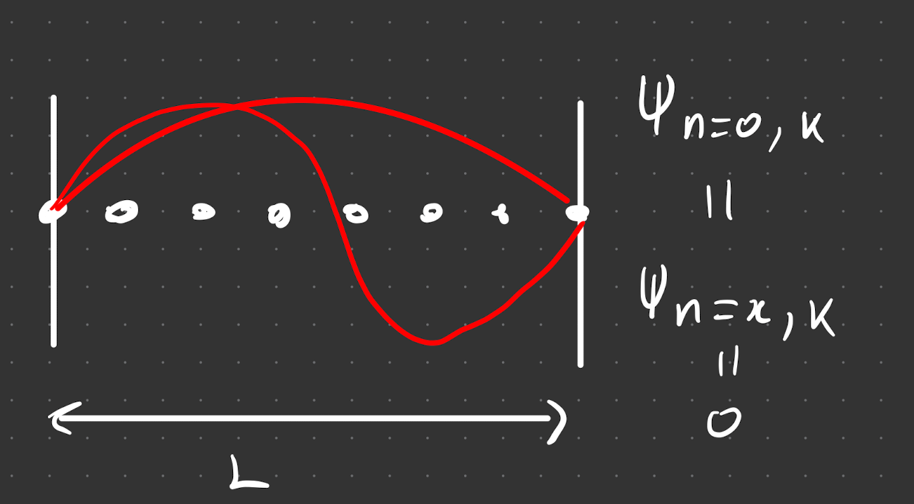
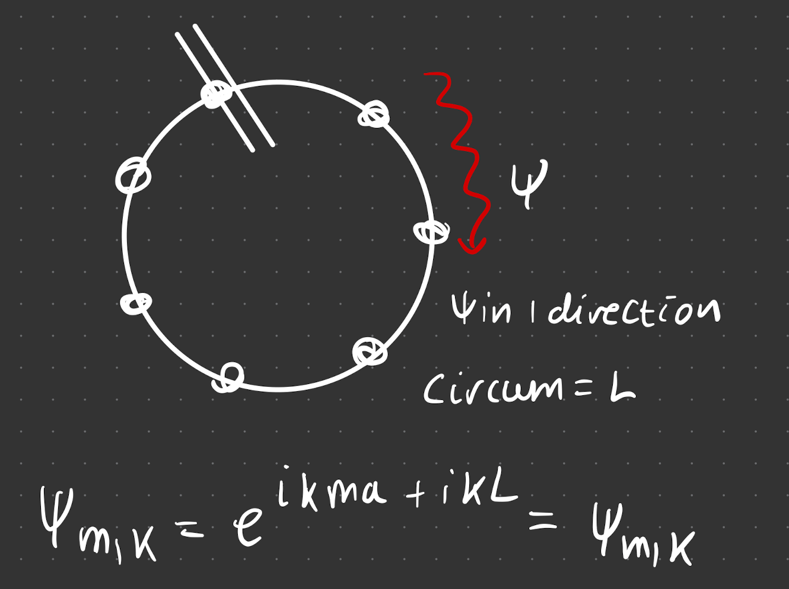
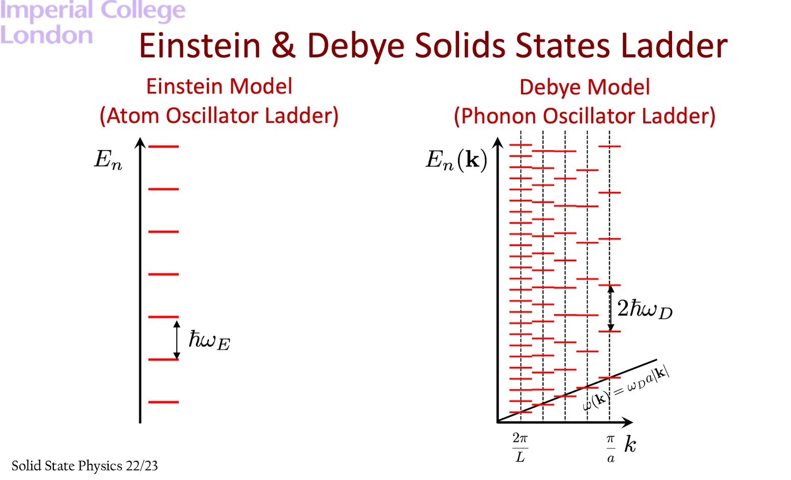

# Quantum and Statistical Mechanics

## Preamble of equations

- constant volume heat capacity (see wiki (ADD LINK))

$$
C_V = \left( \frac{\partial U}{\partial T}\right)_V
$$

- Specific heat capacity 

$$
c_V = \frac{C_V}{N}
$$

Einstein's theory fails at very low temperatures. It follows a $T^3$ relationship

We don't just have one $\omega$, we have many $\omega$ and $k$, so we need to account for all of these.

# Phonons and a Solid's Internal Energy

Steps:

1) Consider 3D dispersion realtion [[PLACEHOLDer]]

2) assume small values of $|\vec k | \ll \frac{\pi}{a}$.\
3) We quantise lattice vibrations (use phonon assumptions) and assume each $\vec k $ state is a QHO (E_n = ...)

4) Following statistical mechanics, u_\vec j = ..

5) Total internal energy

6) a finate size solid $\Rightarrow$ finite number of states. For a phonon (in 1D):

7) from 6), we must count the states. But in doing so, we must also avoid double counting states $\Rightarrow$ choose boundary conditions

## Boundar Conditions

### Fixed boundaries 
- The atoms at the edge don't move. 

We get interference from standing waves, thus they are in the form $\pm k$, so they are counted together

### Eliminate Boundaries (Bourne-Von-Karman BCs)

We can eliminate these BCs by wrapping around the crystal boundaries on themselves. This means the wave will only travel in 1 direction, so 

$$
\psi_{m, k}=e^{i k m a+i k L}=\psi_{m, k}
$$

We will be using these BCs, i.e. $kL = m 2\pi$ 

## real and k space volumes 

## counting states

to find the total internal energy

### high temperature limit

### low temperature limit

(next lecture!)

## Competing Models

The number of DOF become forxen out